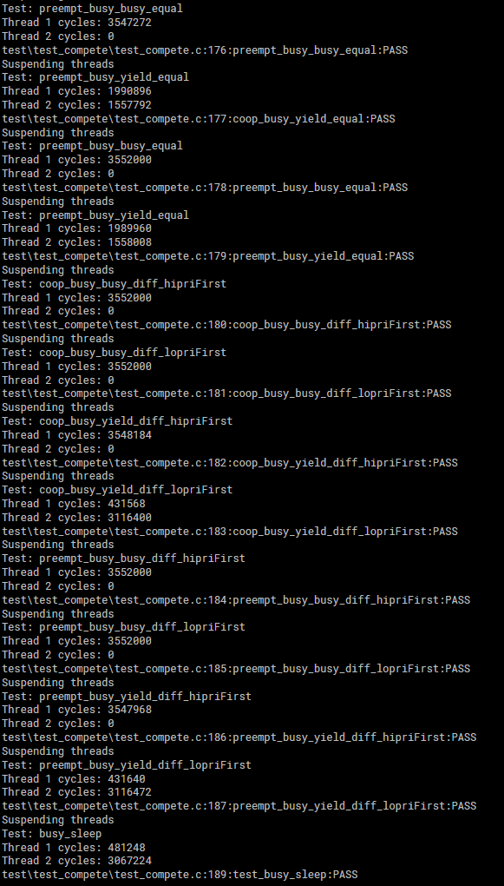

# Lab 6
We evaluated scheduling.

## Activity 0

## Activity 1
For coop busy_busy we guessed that the second thread would never run. 
For coop busy_yield we guessed that the second thread would run after 10ms + however long it took i to reach 8 bits
For preempt busy_busy we guessed that the second thread would never run. 
For preempt busy_yield we guessed that the second thread would run after 10ms + however long it took i to reach 8 bits.
Preempt behaves the same as coop when the priorities are the same. 
For coop busy_busy different priority we guessed that the second thread would never run regardless of which priority started first.
For coop busy_yield different priority we guessed that the second thread would run once the first thread became unready, regardless of priority.
For preemp busy_busy different priority we guessed that the second thread would never run if the higher priority starts first, and that the second thread would run if the lower priority starts first
For preempt busy_yield different priority we guessed that the second thread would run once the first thread became unready if it was lower priority and would run as soon as it came online if it was higher priority.

## Activity 2
